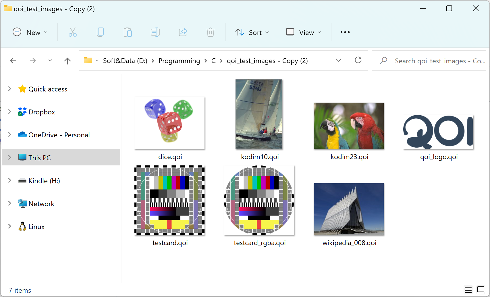

# QOI Thumbnail Provider
Adds thumbnails for [QOI images](https://github.com/phoboslab/qoi) in Windows Explorer



## Supported windows versions

I've tested it on Windows 10 and Windows 11, but I guess it should work on Vista, 7 and 8 as well.

**x64 only at the moment!**

## Installation

1. Download the dll from the [Releases][releases] section
2. Put the dll into the desired place in your system
3. Register the dll using `regsvr32`.
   
   ```
   regsvr32 C:\Path\To\The\Dll\Downloaded\QOIThumbnailProvider.dll
   ```

   You should see confirmation like this:
   

   To unregister the dll later again use `regsvr32`:
   ```
   regsvr32 /u C:\Path\To\The\Dll\Downloaded\QOIThumbnailProvider.dll
   ```

[releases]: https://github.com/iOrange/QOIThumbnailProvider/releases
